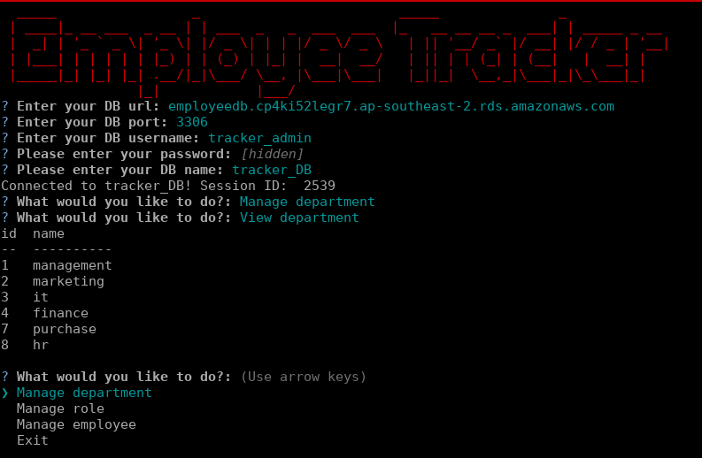

  # trackero

  ---

  ## Description
  Employee tracker using node.js + express + mysql.

  ## Table of Contents
  * [Installation](#installation)
  * [Usage](#usage)
  * [Credits](#credits)
  * [License](#license)   

  ---

  ## Installation
  >This is how to install:

git clone https://github.com/borucltd/trackero.git
cd trackero
npm install
node server.js

  ## Usage
  >Once installed just run the project:

node server.js

At this point you will be prompted to provide your own database details.
To test the project please use DEFAULT values.
Follow the prompts and just manage you employees.

  ## Credits
  >MB

  ## License
  >MIT

  ---

  ## Badges
    

  ## Contributing
  >MIT

  ## Tests
  >Functional testing.

